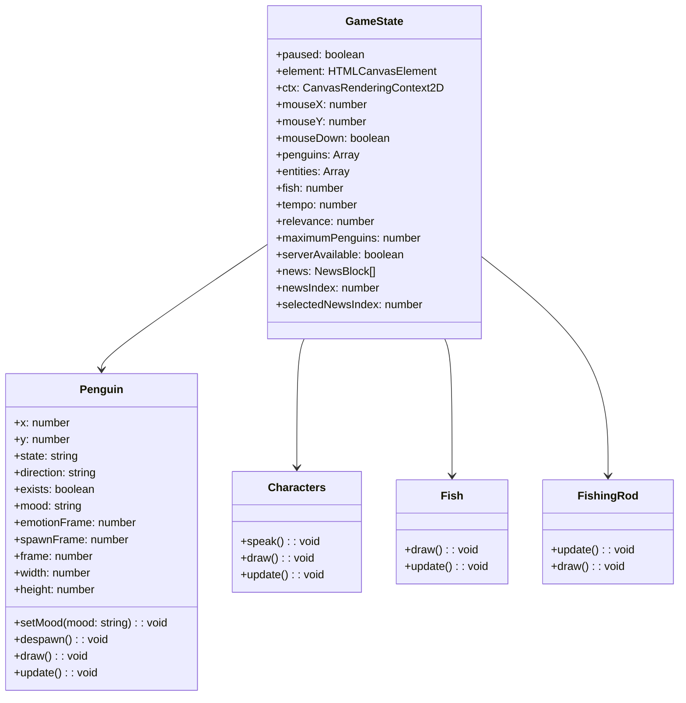

# IceTube

<p align="center">
	
</p>

## Overview

IceTube is a game that allows players to manage their own media outlet while navigating the challenges of fake news. Players will interact with various characters, collect fish, and publish news articles to maintain relevance in the media landscape.

## Features

- Manage your own media outlet
- Interact with various penguin characters
- Collect fish and publish news articles
- Experience dynamic gameplay with changing relevance and character moods
- Engage with a leaderboard to compare scores with other players

## Getting Started

### Prerequisites

- Node.js (version 14 or higher)
- npm (Node package manager)

### Installation

1. Clone the repository:
   ```bash
   git clone https://github.com/TheIceTube/IceTube.git
   cd IceTube
   ```

2. Install the dependencies:
   ```bash
   npm install
   ```

3. Start the development server:
   ```bash
   npm run dev
   ```

4. Open your browser and navigate to `http://localhost:1234` to play the game.

### Building for Production

To build the project for production, run:
```bash
npm run build
```
This will create an optimized version of the game in the `build` directory.

## Class Diagram

The following diagram visualizes the class relationships within the IceTube project:



## Contributing

Contributions are welcome! Please follow these steps to contribute:

1. Fork the repository.
2. Create a new branch (`git checkout -b feature/YourFeature`).
3. Make your changes and commit them (`git commit -m 'Add some feature'`).
4. Push to the branch (`git push origin feature/YourFeature`).
5. Open a pull request.

## License

This project is licensed under the MIT License. See the [LICENSE](LICENSE) file for details.

## Acknowledgments

- Thanks to the contributors and the community for their support and feedback.
- Special thanks to the developers of the libraries and tools used in this project.

---

Feel free to reach out if you have any questions or suggestions! Enjoy playing IceTube!