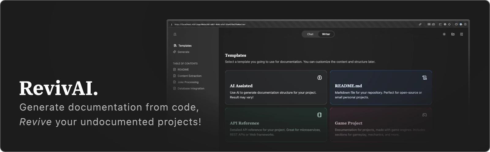

RevivAI is an AI-powered code documentation assistant designed to help developers document their codebases more effectively. It analyses code and generates meaningful documentation, breathing new life into abandoned or poorly documented projects.

<br>

## Features

- **AI-Powered Documentation**: Automatically generate documentation from codebases using advanced language models.

- **Chat With Your Code**: It provides a chat interface where you can ask questions or get explanations about your code.

- **Local Files or Github Repository**: Upload code files directly or link to public GitHub repositories for analysis.

- **Bring Your Own Key**: Easily integrate LLM APIs like OpenAI, OpenRouter, Anthropic, Google or Ollama by providing your own API keys.

- **Customizable Settings**: Configure LLM provider settings and adjust documentation parameters.

<br>

## How to Use It

Before getting started, make sure to complete the [Setup Instructions](#setup-instructions) below. Once the application is running, refer to the guide in the `/guide` folder for detailed instructions on using all available features.

#### [Open the Guide 📚](guide/GUIDE.md)

<br>

## Setup Instructions

To set up RevivAI locally, follow these steps:

1. **Clone the Repository**:
   ```bash
   git clone https://github.com/jrcz-data-science-lab/RevivAI.git
   cd RevivAI
   ```

2. **Install Dependencies**:
   Ensure you have [Node.js](https://nodejs.org/) installed (v22.14 or later) , then run:
   ```bash
   npm install
   ```
> [!NOTE]
> If you getting an errors during `npm install`, try to delete `package-lock.json` and `node_modules` directory, then run `npm install` again.

3. **Environment Variables (Optional)**:
   You can specify default AI provider (Self-hosted Ollama) by setting the following environment variables in a `.env` file at the root of the project:
   ```env
   PUBLIC_OLLAMA_API_URL=your_llm_api_url
   PUBLIC_OLLAMA_API_MODEL=your_llm_model
   ```
> [!NOTE]
> Ollama server should be accessible from the browser. If you are using a self-hosted Ollama server, ensure it is running and accessible at the specified URL. It is recommended to put Ollama server behind a reverse proxy (e.g., Nginx) to handle CORS configurations and rate limit.

4. **Run the Application**:
   Start the development server:
   ```bash
   npm run dev
   ```

5. **Access the Application**:
   Open your browser and navigate to `http://localhost:4321`.

6. **Build for Production** (Optional):
   To build the application for production, specify `.env` variables, and run:
   ```bash
   npm run build
   ```

7. **Start the Production Server**:
   After building, you can start the production server with:
   ```bash
   node dist/server/entry.mjs
   ```

<br>

## Docker
1. Build the Docker image:
   ```bash
   docker build -t revivai .
   ```

2. Run the Docker container:
   ```bash
   docker run -p 3000:3000 --name revivai-app revivai
   ```

<br>

## Contributing

Contributions are welcome! Please follow these steps to contribute:

1. Fork the repository.
2. Create a new branch (`git checkout -b feature-branch`).
3. Make your changes and commit them (`git commit -m 'Add new feature'`).
4. Push to the branch (`git push origin feature-branch`).
5. Open a pull request.

<br>

## Credits
This project was created by [Kirills Reunovs](https://github.com/Kirlovon) as a bachelor thesis project during an internship at the [JRCZ Data Science Labs](https://jrcz.nl/), affiliated with [HZ University of Applied Sciences](https://hz.nl/).


<br>

## License

This project is licensed under the MIT License. See the [LICENSE](LICENSE) file for details.