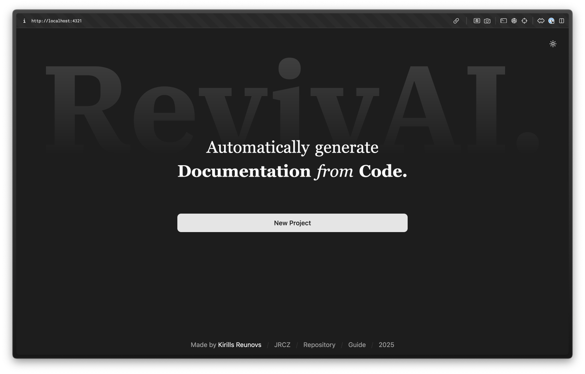

# RevivAI Guide 📚

Welcome to RevivAI! This guide will walk you through all the main features and help you get started with AI-powered code documentation. RevivAI makes it easy to understand, document, and interact with your codebase using advanced language models.

> [!NOTE]
> This guide assumes you have RevivAI running locally or have access to a hosted instance. Check the [README.md](../README.md) for installation instructions.

## Table of Contents
1. [Creating a New Project](#creating-a-new-project)
2. [Setting Up LLM Providers](#setting-up-llm-providers)
3. [Uploading Your Code](#uploading-your-code)
4. [Chatting with Your Codebase](#chatting-with-your-codebase)
5. [Generating Documentation](#generating-documentation)
6. [Settings](#settings)

---

## Creating a New Project

Projects in RevivAI help you organize your work. Each project contains one codebase and all associated chat history and documentation.



### How to Create a Project

1. **Start from the Home Page**: When you first open RevivAI, you'll see the projects page with a list of existing projects (if any).

2. **Click "New Project"**: Click "New Project" button to open the creation dialog.

3. **Enter Project Name**: Give your project a descriptive name like "My Graduation Project" or "Company API Documentation".

4. **Setup LLM Provider**: If you haven't set up an AI provider yet, you'll be redirected to the setup page after creating the project.

> [!TIP]
> Use descriptive project names to easily identify different codebases later. Consider including the project type or version in the name.

### Project Management

- **Browse Projects**: All your projects are listed on the home page, sorted by creation date
- **Open Project**: Click on any project name to open it
- **Delete Project**: Hover over a project and click the trash icon to delete it
- **Project Info**: Each project shows when it was created

---

## Setting Up LLM Providers

RevivAI supports multiple AI providers. You need to configure at least one to use the app's features.


### Supported Providers

RevivAI supports these LLM providers:

- **OpenAI** (GPT-4, GPT-3.5, etc.)
- **Anthropic** (Claude models)
- **Google** (Gemini models)
- **OpenRouter** (Access to multiple models)
- **Ollama** (Local/self-hosted models)
- **Custom API** (Any OpenAI-compatible API)

### Setup Process

1. **Access Setup**: Go to setup from the home page when creating a project, or click "Go to Setup" in project settings.

2. **Choose Provider**: Select your preferred AI provider from the tabs at the top.

3. **Configure Settings**:
   - **API URL**: The endpoint for your chosen provider (pre-filled for popular services)
   - **Model**: Specify the model name (e.g., "gpt-4", "claude-3-sonnet")
   - **API Key**: Your API key for the service

4. **Test Connection**: Click "Test" to verify your settings work correctly.

5. **Save**: Click "Save & Continue" to apply your configuration.

### Getting API Keys

Each provider has different steps to get an API key:

- **OpenAI**: Visit the [OpenAI Developer Portal](https://platform.openai.com/api-keys)
- **Anthropic**: Go to the [Anthropic Console](https://console.anthropic.com/settings/keys)
- **Google**: Access [Google AI Studio](https://aistudio.google.com/app/apikey)
- **OpenRouter**: Check [OpenRouter Settings](https://openrouter.ai/settings/keys)

> [!IMPORTANT]
> Most providers require a paid account, though some offer free tiers with limitations.

### Security Note

All API calls are made directly from your browser to the AI provider. RevivAI never stores or sees your API keys or data.

---

## Uploading Your Code

Before you can chat with your code or generate documentation, you need to upload your codebase to RevivAI.


### Upload Options

RevivAI supports two ways to upload code:

#### 1. Local Files
- **Select Folder**: Click the upload button and select a folder containing your project
- **File Filtering**: Use include/ignore patterns to control which files are uploaded
- **Size Limit**: Individual files larger than 20MB are automatically skipped

#### 2. GitHub Repository
- **Public Repositories**: Enter any public GitHub repository URL
- **Automatic Download**: RevivAI will fetch and process the repository contents

### File Filtering

Control which files are included using glob patterns:

#### Include Patterns
Specify which files to include (comma-separated):
```
src/**/*.js, *.md, package.json
```

#### Ignore Patterns  
Specify which files to exclude (comma-separated):
```
node_modules/**, *.log, dist/**, .git/**
```

> [!WARNING]
> Large codebases can consume many AI tokens and increase costs. Use compression and filtering to optimize your upload.

### Upload Process

1. **Open Upload Dialog**: Click the folder icon in the navigation bar
2. **Choose Method**: Select either "Local Files" or "GitHub Repository"
3. **Configure Filters**: Set include/ignore patterns if needed
4. **Enable Compression**: Check this option to reduce the codebase size for better performance
5. **Upload**: Click "Upload" and wait for processing


### Codebase Information

After upload, you'll see:
- **Total Files**: Number of files processed
- **Token Count**: How many AI tokens your codebase uses
- **Largest Files**: Which files use the most tokens
- **Compression Status**: Whether compression was applied

### Managing Codebases

- **View Current**: See details about your uploaded codebase in the upload dialog
- **Upload New**: Replace the current codebase with a new one
- **File Analysis**: Review which files use the most tokens

---

## Chatting with Your Codebase

The chat feature lets you ask questions about your code and get AI-powered explanations.


### Starting a Chat

1. **Open Chat Tab**: Click on "Chat" in the navigation bar
2. **Welcome Message**: You'll see a welcome message with suggestions
3. **Type Questions**: Use the text input at the bottom to ask questions

### What You Can Ask

The AI can help with many code-related questions:

#### Understanding Code
- "What does this function do?"
- "How does the authentication system work?"
- "Explain the main components of this app"

#### Architecture & Structure
- "What's the overall architecture of this project?"
- "How are the files organized?"
- "Show me the data flow through the application"

#### Specific Implementation
- "How is user registration handled?"
- "What database models are used?"
- "Explain the API endpoints"

#### Diagrams & Visualization
- "Create a diagram showing the class relationships"
- "Generate a flowchart of the user login process"
- "Show the component hierarchy"


### Chat Features

#### Message Management
- **Copy Responses**: Click the copy icon to copy AI responses
- **Delete Messages**: Remove individual messages using the trash icon
- **Clear Chat**: Use the "Clear Chat" badge to start fresh

#### Rich Responses
- **Code Highlighting**: Code snippets are automatically highlighted
- **Mermaid Diagrams**: The AI can generate interactive diagrams
- **Markdown Formatting**: Responses support full Markdown formatting

#### Context Awareness
- **Codebase Context**: The AI has access to your entire uploaded codebase
- **Previous Messages**: Conversations maintain context across messages
- **Token Usage**: See how many tokens you're using in the info bar

### Tips for Better Results

1. **Be Specific**: Ask clear, specific questions for better answers
2. **Reference Files**: Mention specific files or functions when relevant  
3. **Ask for Examples**: Request code examples to illustrate concepts
4. **Request Diagrams**: Ask for visual representations of complex concepts

---

## Generating Documentation

RevivAI can automatically generate comprehensive documentation for your codebase using AI.

> [!TIP]
> Start with a template to get a structured foundation, then customize the chapters to match your project's specific needs.


### Getting Started with Documentation

1. **Open Writer Tab**: Click on "Writer" in the navigation bar
2. **Choose Template**: Start with a pre-built template or create custom chapters
3. **Generate Content**: Use AI to automatically write documentation

### Templates

RevivAI provides several documentation templates:

#### README Template
- Perfect for open-source projects
- Includes project introduction, features, setup instructions
- Covers usage examples and contribution guidelines

#### AI-Assisted Template
- Automatically analyzes your codebase structure
- Generates a custom documentation outline
- Adapts to your specific project type and architecture

> [!NOTE]
> The AI-Assisted template uses your actual code structure to create relevant chapters. Results may vary depending on your codebase complexity.

### Working with Chapters


#### Creating Chapters
- **Add New Chapter**: Click "New Chapter" to create custom sections
- **Chapter Titles**: Use descriptive titles that will become filenames
- **Chapter Outlines**: Write detailed outlines in Markdown format

#### Chapter Editor
- **Title Field**: Set the chapter name and filename
- **Outline Editor**: Write chapter content using Markdown
- **Live Preview**: See how your content will look

#### Organizing Chapters
- **Chapter Navigation**: Click chapter names to switch between them
- **Drag & Drop**: Reorder chapters by dragging them in the sidebar
- **Delete Chapters**: Remove unwanted chapters using the delete button

> [!TIP]
> Write detailed outlines for better AI-generated content. Include specific topics, code examples you want covered, and any diagrams that would be helpful.

### AI Generation Process


#### Starting Generation
1. **Prepare Chapters**: Create chapter outlines describing what you want
2. **Click Generate**: Use the "Generate" button to start AI writing
3. **Monitor Progress**: Watch as chapters are generated in real-time

#### Generation Features
- **Parallel Processing**: Multiple chapters can be generated simultaneously
- **Progress Tracking**: See which chapters are being worked on
- **Error Handling**: Failed generations can be retried
- **Content Quality**: AI writes beginner-friendly, comprehensive content

> [!WARNING]
> Generation can consume significant API tokens, especially for large projects. Monitor your usage and consider enabling parallelization limits if you're concerned about costs.

### Previewing & Exporting Documentation


#### Export Options
- **Download ZIP**: Get all documentation as a compressed archive
- **Preview Files**: View generated content before downloading
- **Multiple Formats**: Files are generated as Markdown (.md) files

#### Export Management
- **Generation History**: See all previous documentation exports
- **Selective Download**: Choose which exports to download
- **File Preview**: View individual files before downloading

### Advanced Features

#### Content Customization
- **Language Support**: Generate documentation in multiple languages
- **Code Examples**: AI includes relevant code snippets from your codebase
- **Diagrams**: Automatic generation of Mermaid diagrams and flowcharts

#### Quality Control
- **Beginner-Friendly**: Content is written for newcomers to understand
- **Technical Accuracy**: AI references actual code from your project
- **Cross-References**: Chapters link to related sections automatically

---

## Settings

Customize RevivAI's behavior through the settings panel to optimize performance and output quality.

> [!NOTE]
> Settings are saved locally in your browser and persist across sessions. Changes take effect immediately.


### Accessing Settings

Click the settings icon (sliders) in the navigation bar to open the settings dialog.

### Available Settings

#### Language Configuration
- **Purpose**: Controls the language used for AI responses and documentation
- **Default**: English
- **Options**: Multiple languages supported including Spanish, French, German, and more
- **Impact**: Affects both chat responses and generated documentation

#### Temperature Control
- **Purpose**: Controls AI creativity and randomness
- **Range**: 0.0 to 2.0
- **Default**: 0.7
- **Lower Values** (0.0-0.5): More deterministic, focused responses
- **Higher Values** (1.0-2.0): More creative, varied responses

#### Parallelization Settings
- **Purpose**: Controls how many chapters are generated simultaneously
- **Options**: 
  - Disabled (1): Generate one chapter at a time
  - 2, 4, 8: Generate multiple chapters in parallel
  - Unlimited: Maximum parallel processing
- **Benefits**: Faster generation with higher values
- **Caution**: May trigger API rate limits with very high values

> [!WARNING]
> Setting parallelization too high can trigger rate limits from your AI provider, causing generation failures. Start with lower values and increase gradually.

### Model Management

#### Changing AI Provider
- **Access**: Click "Go to Setup" in settings
- **Purpose**: Switch between different AI providers or models
- **Redirection**: Takes you back to the setup page
- **Preserves**: Your current project data remains intact

#### Provider Benefits
- **Different Models**: Each provider offers different capabilities
- **Cost Optimization**: Some providers may be more cost-effective
- **Performance**: Different models excel at different tasks

> [!TIP]
> Experiment with different providers to find the best balance of cost, speed, and quality for your specific needs. Some models are better at code analysis, others at creative writing.

### Project Management

#### Project Deletion
- **Location**: Available in project settings
- **Warning**: This action permanently deletes all project data
- **Includes**: Removes codebase, chat history, and generated documentation
- **Confirmation**: Requires explicit confirmation before deletion

### Performance Tips

#### Optimizing Token Usage
- **Monitor Usage**: Check token counts in the info bar during chat
- **File Filtering**: Use include/ignore patterns to reduce codebase size
- **Compression**: Enable compression when uploading large codebases

#### Generation Optimization
- **Parallelization**: Increase for faster generation (if your API allows)
- **Temperature**: Lower values for more consistent documentation
- **Chapter Size**: Break large topics into smaller, focused chapters

---

### Common Issues

- **Rate Limits**: Reduce parallelization if hitting API limits
- **Quality Issues**: Adjust temperature for better content quality
- **Language Problems**: Ensure language setting matches your preference
- **Performance**: Enable compression and optimize file filtering

> [!NOTE]
> RevivAI is designed to be intuitive and user-friendly. Most features work automatically once you've uploaded your codebase and configured an AI provider.
